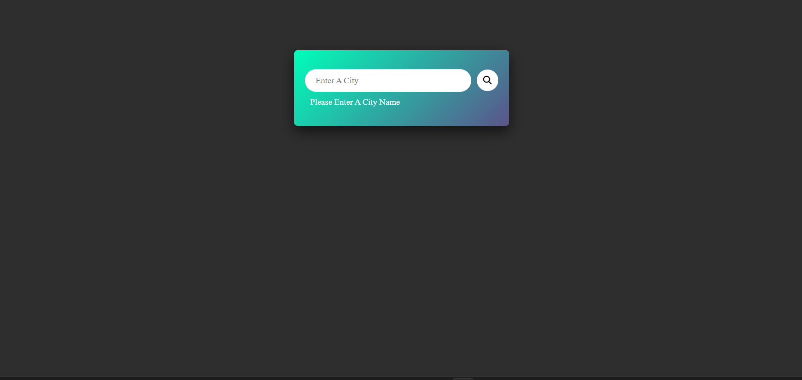
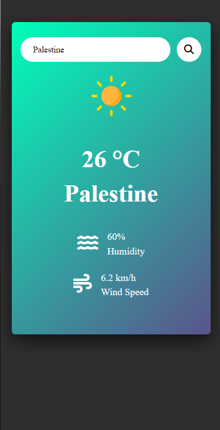

# 🌤️ Weather-App-HTML-CSS-JS

A sleek and responsive weather application built using **HTML**, **CSS**, and **JavaScript**. It fetches real-time weather data from the [OpenWeatherMap API](https://openweathermap.org/) and displays city-specific weather including temperature, humidity, wind speed, and weather condition icon.

---

## 🔧 Project Structure
```
weather-app/
│
├── index.html # Main HTML file
├── style.css # App styling
├── main.js # JavaScript logic
├── images/ # Weather images (e.g. clear.png, rain.png, etc.)
└── README.md # Project overview
```
---
## 🚀 Features

- 🔍 Search for weather by city name
- 🌡️ Displays temperature, humidity, wind speed, and weather icon
- 🌀 Shows loading spinner while fetching data
- ❌ Displays error message for invalid city
- 🎨 Smooth fade-in transitions for weather info
- 📱 Fully responsive design for mobile & desktop
- 🎁 Beautiful gradient UI with subtle shadow effects

---

## 🖼️ Screenshot

> 
> 
> 
> 
> 

---

## 🛠️ Technologies Used

- **HTML5**
- **CSS3** (Flexbox, media queries, gradients, shadows)
- **Vanilla JavaScript (ES6+)**
- **[OpenWeatherMap API](https://openweathermap.org/)**

---

## 💡 How to Use

1. **Clone or Download** the repository:

   ```bash
   git clone https://github.com/Mary-Eqdaih/Weather-App-HTML-CSS-JS.git

   ```
2. **Open** any HTML file (e.g., `index.html`) in your browser to explore.

3. **Customize**:
   - 🏙️ Replace the default city input with your own.
   - 🎨 Modify the layout and styling in style.css
   - 🌤️ Add or update weather icons in the /images folder.
   - 🔑 Insert your API key in main.js: const apiKey = "YOUR_API_KEY_HERE";

---   

## 🔐 API Key Setup

To use the app, you need an [OpenWeatherMap API key](https://openweathermap.org/appid):

1. Sign up at [https://openweathermap.org](https://openweathermap.org)
2. Go to your account > API keys > Create a new key
3. Open `main.js` and replace this line:

```js
const apiKey = "YOUR_API_KEY_HERE"; // Replace with your actual key
```
---

## 🙋‍♀️By
- GitHub: [@Mary-Eqdaih](https://github.com/Mary-eqdaih)


